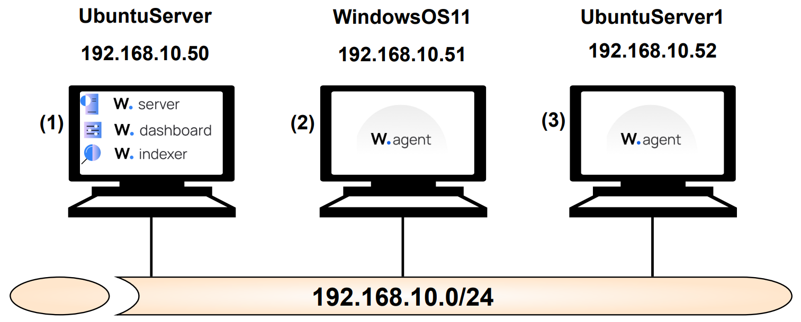

# Despliegue de un escenario de 1 red LAN en Proxmox VE mediante Terraform

Este es el resultado del Trabajo Fin de Grado "Desarrollo de un entorno de red virtual para la implementación y evaluación de un SIEM" realizado por Antonio David Sánchez Molina, estudiante del Grado en Ingeniería de Tecnologías de Telecomunicación en la Universidad de Granada.

Mediante estos archivos es posible hacer un despliegue del siguiente escenario en Proxmox VE a través de la herramienta Infrastructure as Code Terraform:

Este cuenta con una red LAN y sobre el mismo, se implementa el SIEM Wazuh (servidor, indexador, dashboard, agentes...) mediante conexiones SSH desde Terraform a las máquinas virtuales, una vez ya desplegadas. Cabe destacar que, la creación de las máquinas se realiza a partir de plantillas preconfiguradas.
